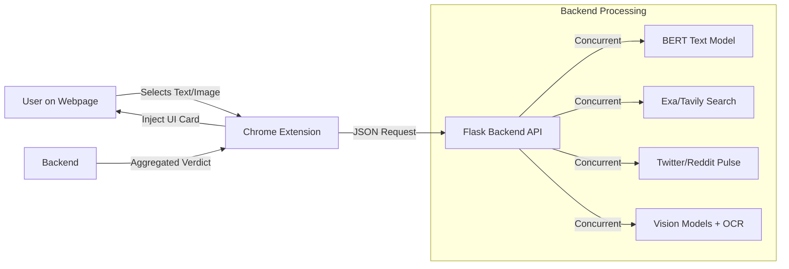

# Veritas Architecture & Workflow

This document explains the internal working of the **Veritas** news verification system, detailing how the browser extension interacts with the AI backend to detect fake news and deepfakes.

## 🏗️ System Overview

The system consists of two main components:
1.  **Chrome Extension (Frontend)**: Captures user context (text/images) and injects analysis results into the webpage.
2.  **Flask API (Backend)**: High-performance server running AI models and handling external API integrations.



---

## 🔍 1. Text Verification Pipeline (`/analyze`)

When a user selects text and clicks "Verify news":

1.  **Request**: Extension sends the selected text to the backend.
2.  **Parallel Processing**: The backend launches multiple threads to analyze simultaneously:
    *   **AI Classification**: A fine-tuned **BERT** model (`fake-news-bert-base-uncased`) classifies the writing style (Fake vs. Real).
    *   **Fact Checking**: Query **Exa.ai** and **Tavily** for reputable sources matching the claim.
    *   **Social Context**: Search **Twitter (X)** and **Reddit** for real-time discussions and community sentiment.
3.  **Aggregation**:
    *   Combines AI confidence score with the number of reputable sources found.
    *   Calculates a community accuracy score based on social sentiment.
4.  **Response**: Returns a verdict (e.g., "Likely Real"), confidence score, and list of sources.

---

## 🖼️ 2. Image Verification Pipeline (`/analyze-image`)

When a user right-clicks an image and selects "Analyze image":

1.  **Capture**: Extension captures the image URL or Base64 data (bypassing CORS using dynamic script injection).
2.  **Request**: Sends image data to the backend.
3.  **Multi-Modal Analysis**: The backend performs three distinct checks in parallel:

### A. Deepfake Detection (Ensemble)
We use a weighted voting system of multiple models:
*   **Primary**: `umm-maybe/AI-image-detector` (High accuracy detector)
*   **Secondary**: `prithivMLmods/Deep-Fake-Detector-v2`
*   **Local Custom**: Custom fine-tuned ViT model (if available)

### B. OCR Text Verification (New!)
*   **Extraction**: Uses **EasyOCR** to extract embedded text from the image (e.g., headlines, tweets, captions).
*   **Verification**: If text is found (>20 chars), it runs through the **Text Verification Pipeline** (BERT + Search).
*   **Impact**: Even if an image is "Real", if it contains **Fake News text**, the verdict is flagged.

### C. GPT-4 Vision (Optional)
*   If an OpenAI key is active, GPT-4 Vision provides a high-level cognitive analysis of the image context.

### Decision Logic
The final verdict is a weighted combination:
```python
if image_is_deepfake > 65%:
    return "AI Generated"
elif text_in_image_is_fake:
    return "Contains Fake News Text"
else:
    return "Likely Authentic"
```

---

## ⚡ Performance Optimization

To ensure a smooth user experience, the system uses **Concurrency**:
*   **Threading**: `ThreadPoolExecutor` runs neural networks, web searches, and social APIs in parallel threads.
*   **Timeouts**: strict 15-30s timeouts prevent one slow API from blocking the entire result.
*   **Latency**: Reduced average analysis time from ~8s to **~2-3s**.

## 🛠️ Technology Stack

| Component | Technology | Purpose |
|-----------|------------|---------|
| **Extension** | JavaScript (Vanilla) | DOM manipulation, Shadow DOM UI injection |
| **Backend** | Flask (Python) | API server, Request handling |
| **Text AI** | Transformers (BERT) | Fake news classification |
| **Image AI** | PyTorch, EasyOCR | Deepfake detection, Text extraction |
| **Search** | Exa, Tavily | Neural web search for fact-checking |
| **Social** | Tweepy, PRAW | X (Twitter) and Reddit data fetching |
