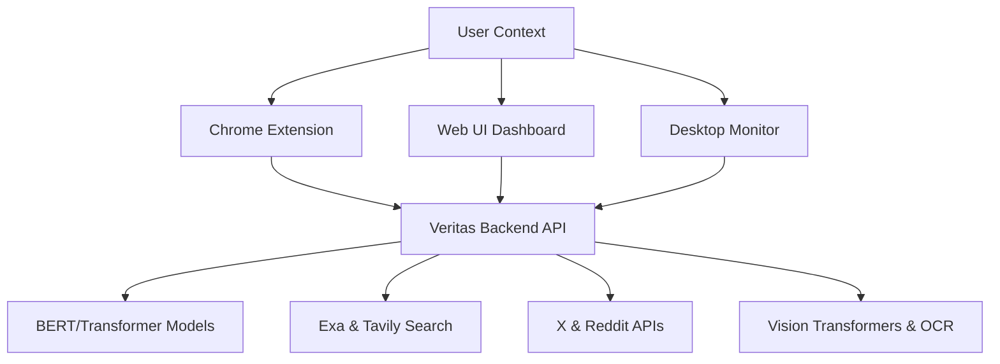

# 🛡️ Veritas: AI-Powered Truth Verification Ecosystem

Veritas is a multi-modal news verification system designed to combat misinformation and deepfakes. It combines fine-tuned NLP models, neural web search, and social media analysis to provide real-time credibility assessments.

## 🚀 Key Features

- **3-Stage Text Verification**: Processes claims through a pipeline of Exa/Tavily search, Scira aggregation, and OpenAI GPT-4 analysis.
- **Deepfake & Image Analysis**: Ensemble model approach to detect AI-generated images and manipulated content.
- **Visual OCR**: Extracts text from images to verify embedded claims against real-time news sources.
- **Social Media Pulse**: Fetches real-time discussions from X (Twitter) and Reddit to gauge community sentiment.
- **Multi-Interface Access**: Choose between a Web Dashboard, a Background Desktop Monitor, or a native Chrome Extension.

---

## 🏗️ Project Architecture



---

## 🛠️ Installation & Setup

### 1. Prerequisites
- Python 3.10+
- Chrome Browser (for extension)

### 2. Backend Setup
1. Clone the repository and navigate to the root directory.
2. Install dependencies:
   ```bash
   pip install -r backend/requirements.txt
   ```
3. Configure environment variables:
   - Copy `backend/.env.example` to `backend/.env`.
   - Fill in your API keys (Exa, Tavily, OpenAI, etc.).

### 3. Running the Application

#### A. Web UI Dashboard
Launch the browser-based interface:
```bash
python backend/web_app.py
```
Access at: `http://127.0.0.1:5000`

#### B. Desktop Monitor (Global Hotkey)
Enable system-wide verification using `Alt+Shift+C`:
```bash
python backend/desktop_simple.py
```

#### C. Chrome Extension
1. Open Chrome and go to `chrome://extensions/`.
2. Enable "Developer mode".
3. Click "Load unpacked" and select the `extension/` folder.
4. **Hotkey**: Select text and press `Alt+Shift+C` (ensure the backend is running).

---

## 📁 Repository Structure

- `backend/`: Core Flask API, AI service logic, and desktop scripts.
- `extension/`: Chrome extension files for browser integration.
- `env/`: Recommended virtual environment location (ignored by git).

---

## 🛡️ Security
This project uses `.env` files for API keys. **Never commit your `.env` file.** A template is provided in `backend/.env.example`.

---

## 📄 License
MIT License. See [LICENSE](LICENSE) for details.
